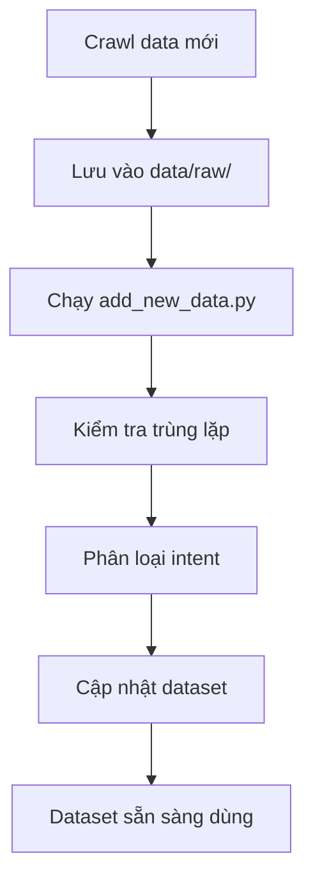

# 🤖 CTU Chatbot Dataset Workflow

## 📋 Tổng quan

Workflow mới để quản lý dataset chatbot tư vấn tuyển sinh CTU **KHÔNG BỊ TRÙNG LẶP**.

## 🗂️ Cấu trúc thư mục

```
CTU_Chatbot/
├── data/
│   ├── raw/                    # Dữ liệu thô mới crawl
│   ├── processed/              # Dữ liệu đã xử lý theo intent
│   ├── final/                  # Dataset cuối cùng
│   └── .migration_complete     # Marker file (tự động tạo)
├── scripts/
│   ├── migrate_old_data_once.py    # Migrate data cũ 1 lần duy nhất
│   ├── add_new_data.py             # Thêm data mới vào dataset
│   └── migrate_to_intent.py        # Script cũ (không dùng nữa)
├── config/
│   └── intents.json            # Định nghĩa intent categories
└── output/                     # Dữ liệu cũ (level 1-5)
```

## 🚀 Workflow mới

### Bước 1: Migrate data cũ (CHỈ 1 LẦN DUY NHẤT)

```bash
python scripts/migrate_old_data_once.py
```

**Chức năng:**
- ✅ Load TẤT CẢ data cũ từ level 1-5
- ✅ Tạo dataset ban đầu với 244 Q&A pairs
- ✅ Tạo marker file để không chạy lại
- ✅ Tổ chức theo intent categories

**Kết quả:**
- `data/final/ctu_chatbot_dataset.json` - Dataset chính
- `data/processed/[intent]_qa.json` - Files theo intent
- `data/.migration_complete` - Marker file

### Bước 2: Crawl data mới

```bash
# Ví dụ: Crawl từ URL mới
python your_crawler.py > data/raw/new_crawl_2024.json
```

### Bước 3: Thêm data mới vào dataset

```bash
python scripts/add_new_data.py data/raw/new_crawl_2024.json
```

**Chức năng:**
- ✅ Chỉ load data MỚI từ file chỉ định
- ✅ Kiểm tra trùng lặp với dataset hiện tại
- ✅ Chỉ thêm Q&A pairs UNIQUE
- ✅ Tự động phân loại intent
- ✅ Cập nhật dataset cuối cùng

## 🎯 Ví dụ sử dụng

### Lần đầu tiên (migrate data cũ):

```bash
# Chạy 1 lần duy nhất
python scripts/migrate_old_data_once.py
```

Output:
```
🚀 Starting ONE-TIME migration of old data...
📋 Loaded 10 intent categories
📄 Loading from level3_combined_extracted.json: 67 Q&A pairs
📄 Loading from level4_combined_extracted.json: 80 Q&A pairs
📄 Loading from level5_combined_extracted.json: 65 Q&A pairs
✅ Total OLD Q&A pairs found: 244
📊 Intent distribution:
   📂 nganh_hoc (Hỏi về ngành học): 58 pairs
   📂 xet_tuyen (Hỏi về xét tuyển): 54 pairs
   📂 thong_tin (Thông tin chung): 43 pairs
✅ Final dataset saved: data/final/ctu_chatbot_dataset.json
🎉 ONE-TIME migration completed successfully!
```

### Lần thứ 2 trở đi (thêm data mới):

```bash
# Crawl data mới
python your_new_crawler.py > data/raw/level6_data.json

# Thêm vào dataset
python scripts/add_new_data.py data/raw/level6_data.json
```

Output:
```
🚀 Adding NEW data to existing dataset...
📊 Existing dataset: 244 Q&A pairs
📄 Loading NEW data from level6_data.json: 50 Q&A pairs
🔍 Duplicate check: 5 duplicates found, 45 unique new pairs
✅ Added 45 new Q&A pairs to dataset
📊 Before: 244 pairs
📊 After: 289 pairs
📊 Added: 45 new pairs
🎉 New data added successfully!
```

## 🔧 Tính năng chính

### 1. Chống trùng lặp thông minh
- So sánh câu hỏi (case-insensitive)
- Chỉ thêm Q&A pairs thực sự mới
- Báo cáo số lượng trùng lặp

### 2. Phân loại intent tự động
- Mapping theo category cũ
- Phát hiện intent qua keywords
- 10 intent categories được định nghĩa

### 3. ID management
- ID tự động tăng dần
- Không bị conflict
- Dễ tracking

### 4. Versioning
- Theo dõi ngày tạo/cập nhật
- Lưu source level
- Metadata đầy đủ

## 📊 Intent Categories

1. **nganh_hoc** - Hỏi về ngành học
2. **xet_tuyen** - Hỏi về xét tuyển  
3. **hoc_phi** - Hỏi về học phí
4. **lien_he** - Hỏi về liên hệ
5. **thong_tin** - Thông tin chung
6. **ky_tuc_xa** - Hỏi về ký túc xá
7. **chuong_trinh_dac_biet** - Chương trình đặc biệt
8. **ho_so_dang_ky** - Hỏi về hồ sơ đăng ký
9. **thoi_gian_lich_trinh** - Thời gian lịch trình
10. **diem_chuan_ket_qua** - Điểm chuẩn kết quả

## ⚠️ Lưu ý quan trọng

### ❌ KHÔNG làm:
- Chạy `migrate_old_data_once.py` nhiều lần
- Dùng `migrate_to_intent.py` (script cũ)
- Xóa file `.migration_complete`

### ✅ NÊN làm:
- Chỉ dùng `add_new_data.py` để thêm data mới
- Backup dataset trước khi thêm data lớn
- Kiểm tra format JSON trước khi thêm

## 🔄 Quy trình hoàn chỉnh



## 💡 Tips

1. **Đặt tên file có ý nghĩa:**
   ```bash
   data/raw/ctu_dormitory_2024.json
   data/raw/new_majors_info.json
   ```

2. **Kiểm tra kết quả:**
   ```bash
   # Xem thống kê dataset
   python -c "import json; data=json.load(open('data/final/ctu_chatbot_dataset.json')); print(f'Total: {data[\"dataset_info\"][\"total_pairs\"]} pairs')"
   ```

3. **Backup định kỳ:**
   ```bash
   cp data/final/ctu_chatbot_dataset.json backups/dataset_$(date +%Y%m%d).json
   ```

---

🎉 **Workflow này đảm bảo dataset luôn sạch, không trùng lặp và dễ quản lý!** 